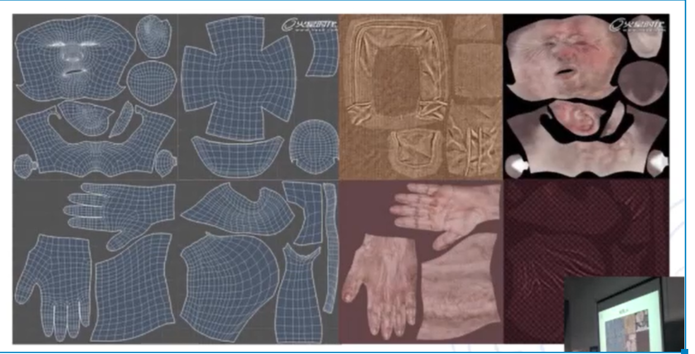
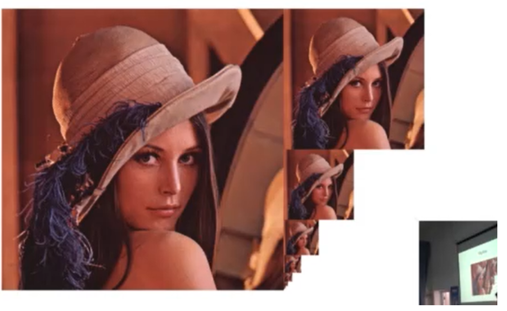
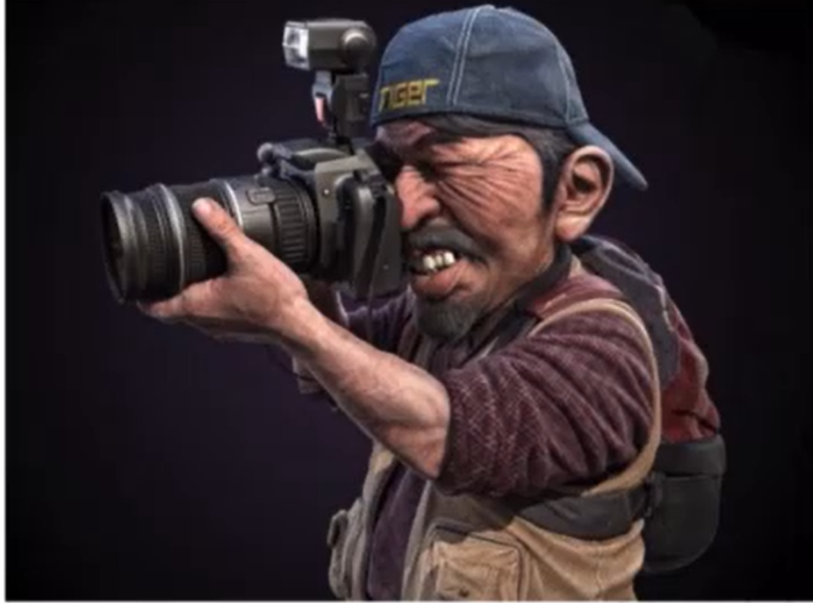
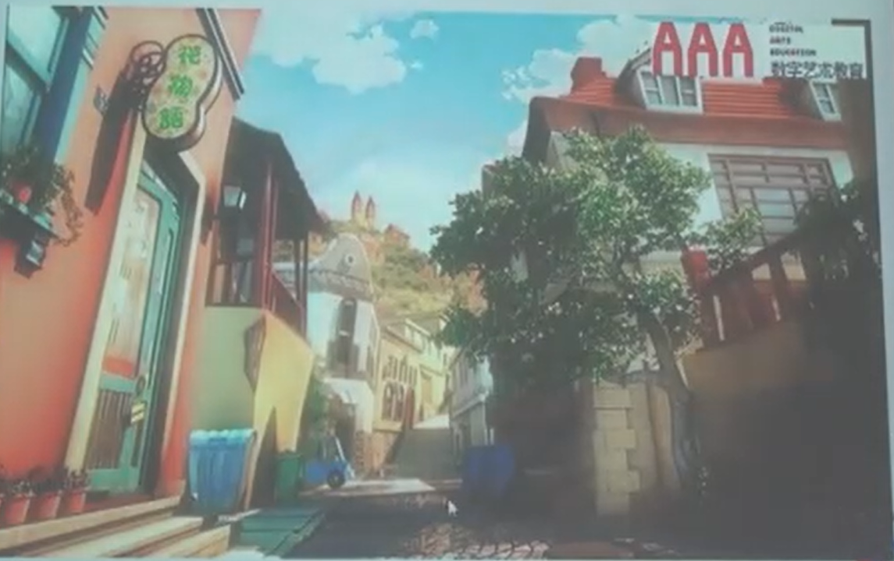
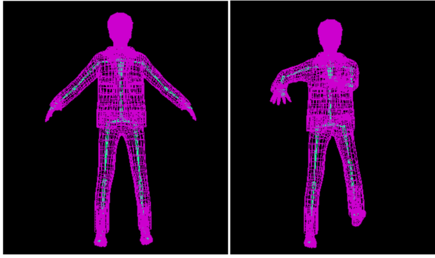

# **游戏的渲染技术概览**

-------------
## 目录

* [1.游戏渲染流程](#1-游戏的渲染流程)

* [2.顶点数据](#2-顶点数据)
* [3.uv坐标和贴图](#3-uv坐标和贴图)
* [4.Mip Map](#4-Mip Map)
* [5.材质](#5-材质)
* [6.景深图](#6-景深图)
	
	* [6.1景深图的应用 DOF](#61-景深图的应用 DOF)
	* [6.2景深图的应用 SSAO](#62-景深图的应用 SSAO)
* [7.蒙皮骨骼动画](#7-蒙皮骨骼动画)
  
  

----------------
## 1. 游戏的渲染流程

## 2. 顶点数据

在游戏中我们所见到的人物场景等等的物体实质上都是由三角形来组成的，而组成三角形的点就被称为顶点，一个物体想要被计算机渲染出来的话我们就提供它的顶点数据，然后将这些顶点数据放到渲染管线中处理之后就可以将一个物体显示在计算机屏幕上了。

通常来说一个顶点的数据包括

- 位置坐标数据 - 表示该顶点的位置
- 颜色数据 - 表示该顶点的颜色(不是必要的)
- 法线数据 - 用来进行光照等等的计算
- 骨骼权重数据 - 用来提供蒙皮骨骼动画的实现
- 贴图uv数据 - 用来进行贴图的映射

------

## 3. uv坐标和贴图

贴图实质上是一个二维数组里面保存着一些颜色信息。如下图所示。

uv坐标的作用是将贴图的的颜色数据映射到三角形中。通过一些插值方法。

------

## 4. Mip Map

MipMap 其实是一系列的贴图，它们都一张贴图的不同大小的副本。如下图所示。当进行渲染的时候计算机根据当前摄像机和要进行渲染的物体的距离来从一张贴图的MipMap中选择合适大小的贴图来进行渲染。

------

## 5. 材质

材质实际上就是一些数据，这些数据使用来计算的，比如一些需要参与到光照计算中的参数。这些参数可以改变一个物体最终呈现的效果。如下图所示。该图中有摄像机，帽子，牙齿，衣服(不同的衣服不同的材质)，背包，毛发等等这几种不同的材质，这几种不同的材质最终呈现给我们不同的视觉效果。

------

##  6. 景深图

景深图是一种将场景距离摄像机的距离进行数据可视化的一种方式，一张景深图本质上就是一个二维的数组，其中每一个元素表示对应的像素距离摄像机的距离也就是景深，范围在【0，1】之间。如下图所示。

对于景深图来说当一个像素离对应的物体离摄像机越远在景深图中就越暗(数值越接近0)，否侧越亮(数值越接近1)。通过使用景深图可以实现一些特殊的技术。

​											场景原图

​																				景深图

### 6.1 景深图的应用 DOF

DOF 是指游戏中的景深效果，如下图所示，它是根据当前画面的景深图，距离摄像机越远的场景会越模糊，而越近的场景会越清晰。

​																			DOF 效果图

### 6.2 景深图的应用 SSAO

SSAO 是指屏幕空间环境光屏蔽，根据当前游戏画面的景深图和一些算法来生成一张新的图，然后将原来的游戏画面和新形成的图进行叠加就可以达到增加原来游戏场景画面质量的效果。

​																		未使用SSAO时

​																根据景深图和一些算法生成一张新图

​																	前面两张图的叠加效果

------

## 7. 蒙皮骨骼动画

蒙皮骨骼动画是一种实现动画的方式，它是通过给模型赋予一个骨骼，模型中每一个顶点都对每一根骨骼都一个权重值，动画播放的过程是对模型中骨骼的变换，然后每一个顶点根据自己对骨骼的权重来计算出自己对应的变换，从而导致顶点的移动（这些计算是在顶点着色器中进行的）。通过这种骨骼带动顶点的方式来实现动画的播放。

