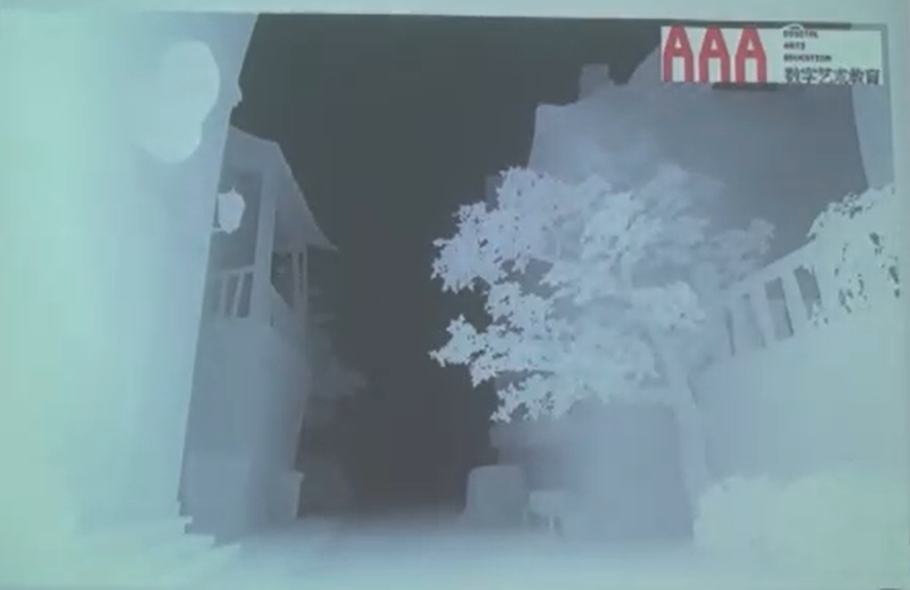
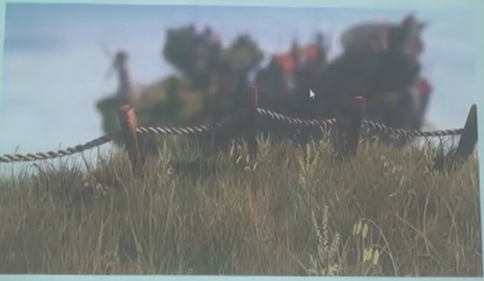
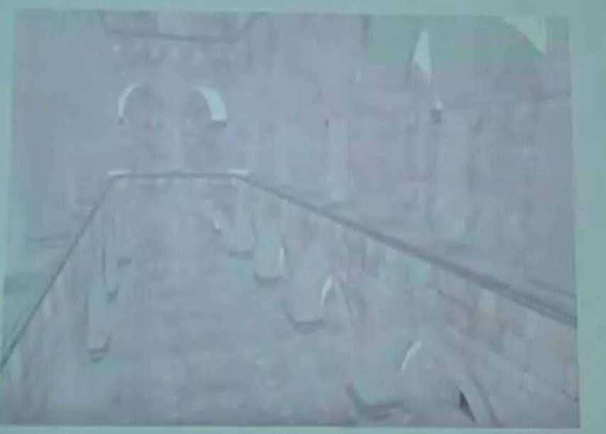
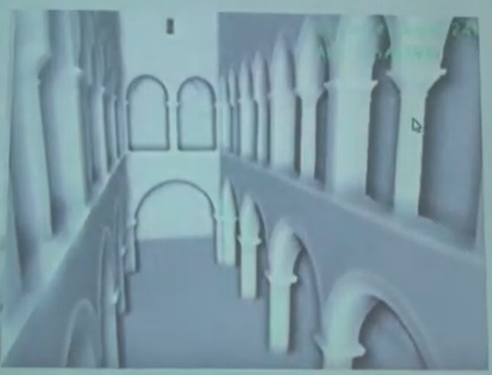
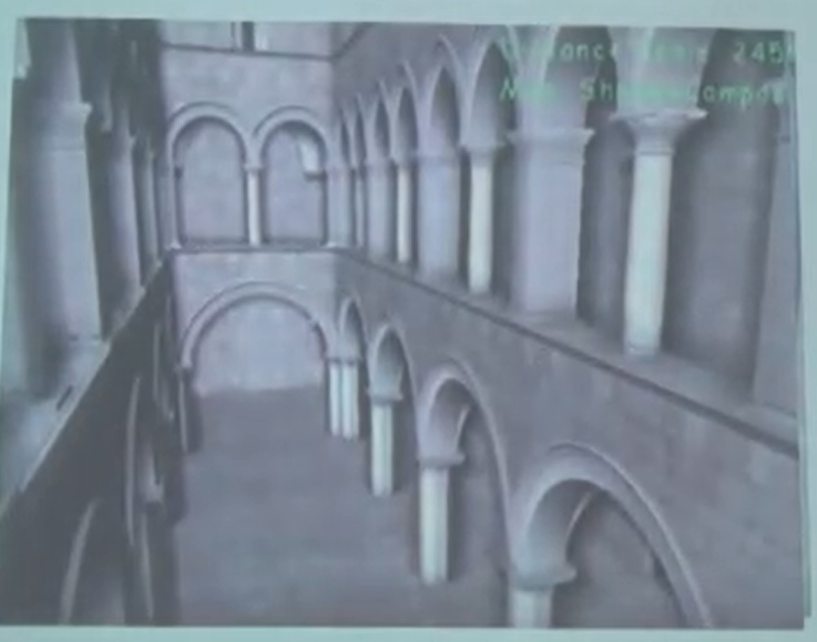

# **游戏的渲染过程**

-------------
## 目录
* [1.游戏渲染流程](#1.-游戏的渲染流程)

* [2.渲染技术及其应用](#2.-渲染技术及其应用)

  * [2.1 景深图](#2.1-景深图)
    * [2.1.1 景深图的应用-DOF](#211-景深图的应用 -DOF)
    * [2.1.3 景深图的应用-SSAO](#212-景深图的应用 - SSAO)
  * [2.2 动画相关 ](#22-动画相关)
    * [2.2.1 蒙皮骨骼动画](#2.2.1-蒙皮骨骼动画)
  
  
  
  

----------------
## 1.游戏的渲染流程

## 2. 渲染技术及其应用

### 2.1 景深图

景深图是一种将场景距离摄像机的距离进行数据可视化的一种方式，一张景深图本质上就是一个二维的数组，其中每一个元素表示对应的像素距离摄像机的距离也就是景深，范围在【0，1】之间。如下图所示。

对于景深图来说当一个像素离对应的物体离摄像机越远在景深图中就越暗(数值越接近0)，否侧越亮(数值越接近1)。通过使用景深图可以实现一些特殊的技术。

​											场景原图

​																				景深图

#### 2.1.1 景深图的应用 -DOF

DOF 是指游戏中的景深效果，如下图所示，它是根据当前画面的景深图，距离摄像机越远的场景会越模糊，而越近的场景会越清晰。

​																			DOF 效果图

#### 2.1.2 景深图的应用 - SSAO

SSAO 是指屏幕空间环境光屏蔽，根据当前游戏画面的景深图和一些算法来生成一张新的图，然后将原来的游戏画面和新形成的图进行叠加就可以达到增加原来游戏场景画面质量的效果。

​																		未使用SSAO时

​																根据景深图和一些算法生成一张新图

​																	前面两张图的叠加效果

### 2.2 动画相关

------

#### 2.2.1 蒙皮骨骼动画
