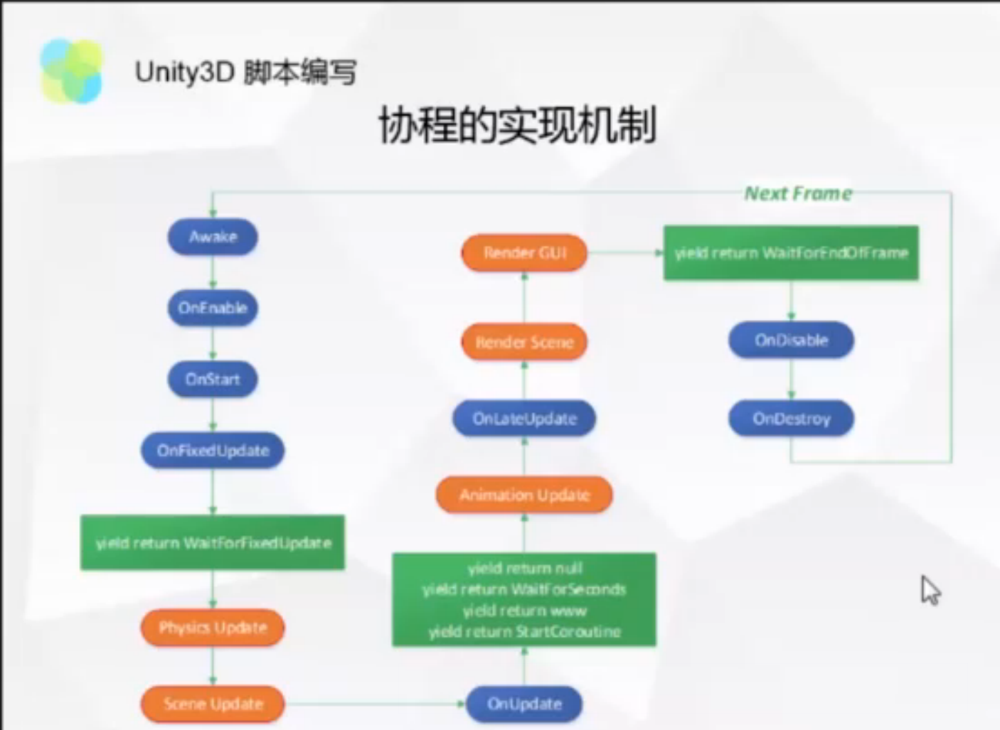
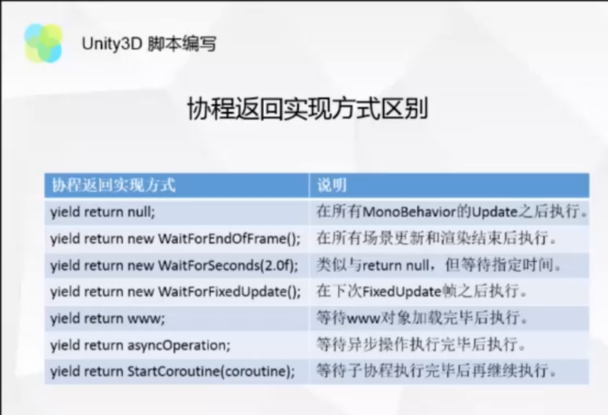

# 游戏逻辑系统

## 什么是游戏逻辑系统
+ 包括
	+ 用来构建游戏的玩法
	+ 实现程序和玩家的交互

+ 不包括
	+ 游戏的画面和音频表现效果。
	+ 游戏引擎的程序基础功能模块，包括动画，物理，场景管理，内存管理等等。

--------------------------

## 逻辑系统设计的目的
一个游戏会在整个项目开发周期内多次迭代，要求快速验证，持续改造，因此要求游戏逻辑系统要具有。
+ 高性能 - 保证逻辑的高效运行。
+ 开发效率 - 能进行快速的迭代。
+ 拓展性 - 能够比较好的添加新的功能。
+ 健壮性 - 程序功能的正确。

------------------------

## 游戏逻辑的常用语言
+ C++ 
	+ 直接编译为对应平台的机器码，执行效率高。 
+ C#	
	+ 编译为MISL (微软中间代码)，然后在执行的时候通过C#的一个运行时库来将中间代码分段的编译为机器码。
+ JAVA	
	+ 编译为JAVA bytecode ，然后由JVM来解释执行
+ LUA	
	+ 通过在运行时对lua进行解析来执行。例如C++在运行时读入对应的lua脚本字符串，然后根据lua语法的解析器将lua语言解释成对应的函数调用，变量创建等等的操作来控制程序的执行。

--------------------------------
## 为什么要使用脚本进行游戏逻辑的开发

+ 灵活性
+ 开发效率高
+ 可热更新
+ 能随时的更改游戏的逻辑表现，减少等待编译的时间

---------------------------------------

## Unity 中的 C#

Unity 中的 C# 其实和微软的是不太一样的。Unity 最优秀的地方在于它的跨平台功能，当时微软刚开始设计C# 的想法是只想让C# 运行在自己的操作系统中。那Unity 是如何做到跨平台这一点的呢。方法是Unity 使用了Mono运行时库，微软在Window上运行C# 是使用了.Net FrameWorlk 的运行库，这些运行时库的作用是按照C# 的语法解析C# 并且执行。Mono本身就实现了这个跨平台的功能，所以unity 使用Mono来作为C# 的运行时库这样就解决了跨平台的问题。但是unity 有如下几个问题。

- Mono 开源，跨平台，但是unity 本身使用的Mono版本比较老旧所以性能相比微软的.Net FrameWork 就更低。
- 在IOS上，unity 使用了IL2CPP 这么一个东西，这个东西是让IL 中间语言代码转换为C++ 的一种工具。这样的话在IOS上运行程序的性能就比Android更高，在加上Android本身性能就比IOS低这种差距就很明显。(但是Unity 也开始在Android提供这种将IL转为C++的功能虽然还有很多BUG)

------

## Unity  中各种函数的执行顺序

------

## Unity 中的协程

Unity 中的协程其实本质上其实就是一个枚举器。它的作用是将一个过程(函数)的工作内容分摊到几帧来进行执行。每一帧只执行其中的一个部分。Unity 内部会保存一个枚举器每一帧都将枚举器MoveNext 如果还有，那么在下一帧继续执行。协程返回的实现区别如下图所示。Unity使用协程来模拟多线程的异步执行方式，但是实际上协程的执行过程都是在主线程中的。协程不能一次过多的创建这样会增加GC压力和加大分配内存的开销。

------

## 游戏中的系统

- 资源管理系统

  - 主要是进行资源的管理，加载等等。
- 关卡管理系统
  
  - 关卡管理系统，主要是用来进行除已加载场景外，其他场景的加载和切换。
  - 记录场景文件名，角色入口点，跳转点。
  - 记录关卡内怪物的类型和分布位置。
- 输入管理系统
  
  - 游戏引擎一般都提供了引擎自身的输入管理功能，但是我们一般都需要对其进行封装来符合游戏的特定需求，比如什么时候不能按什么键，什么时候按键映射到不同的轴等等。
- 角色管理系统

  - 用来管理场景中的人物，玩家，怪物，甚至是一些可交互物体。
  - 负责角色创建，管理和逻辑更新等等的事情。
- 游戏动画系统
  - 管理动画资源，并读取动画资源
  - 更新动画来进行画面表现
  - 输出其他动画给其他模块。

